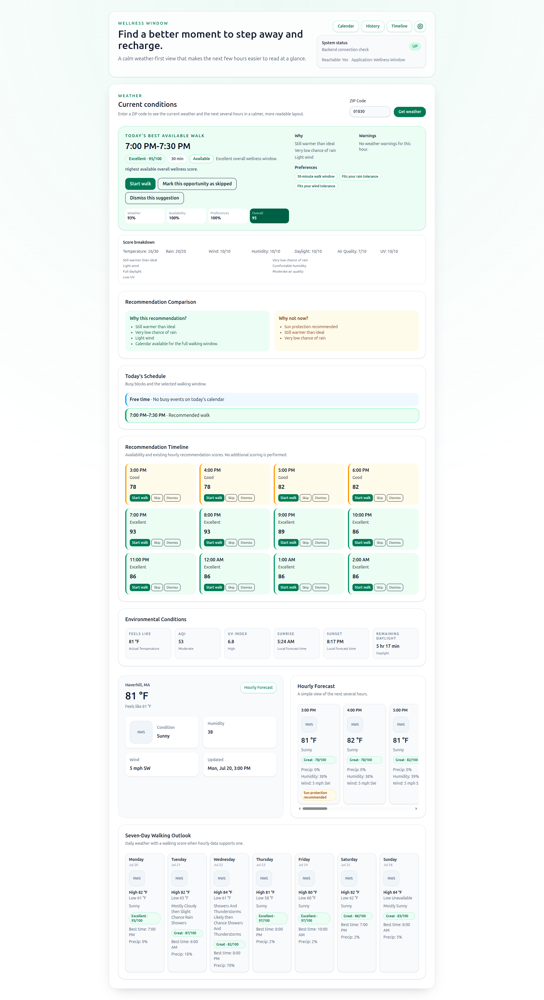
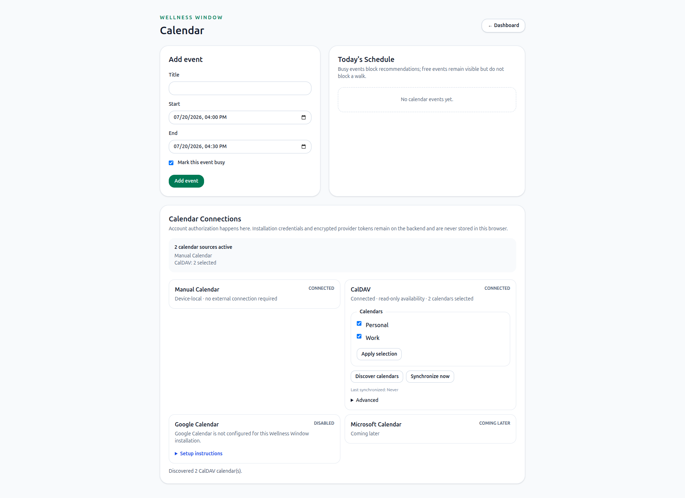
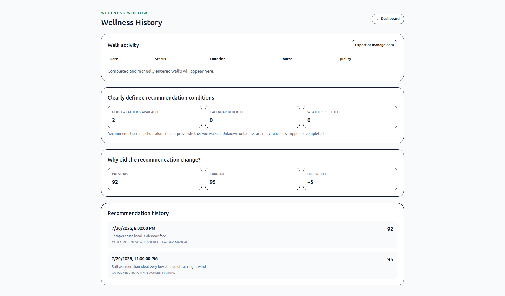
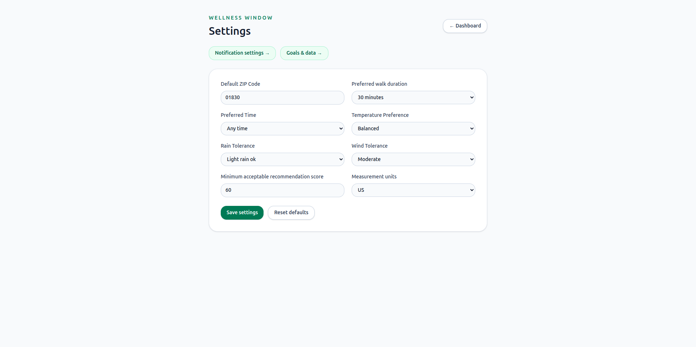

# Wellness Window

Wellness Window helps a user decide when to take a short restorative walk by combining live weather, optional environmental context, calendar availability, and transparent recommendation scoring.

Version 2.7 completes the walk-outcome controls, completion feedback, automatic opportunity expiry, protected history deletion, notification actions, browser-level testing, and install/update/offline PWA experience. Recommendations remain deterministic, completion is never inferred, and external calendars remain read-only.

## Problem Statement

Weather apps provide conditions, but they do not answer the practical question: "Is this a good moment to step away for a walk?" Wellness Window reduces that decision friction with a readable dashboard, explainable scoring, and lightweight user preferences.

## Major Features

- 5-digit US ZIP weather lookup.
- Zippopotam.us ZIP-to-coordinate lookup.
- National Weather Service current, hourly, and seven-day forecast data.
- Official NWS weather icons with accessible fallback placeholders.
- Optional Open-Meteo environmental data for AQI, UV Index, sunrise, and sunset.
- Explainable walking score and best-window selection.
- Hourly forecast cards and seven-day walking outlook.
- Browser-local preferences for default ZIP, duration, comfort preferences, minimum score, and display units.
- Browser-local manual calendar with add, edit, delete, and busy/free controls.
- Provider registry and bounded synchronization with optional CalDAV events.
- Principal/calendar-home discovery and independent multi-calendar synchronization.
- Availability-aware recommendations and a daily schedule timeline.
- Configurable 15/30-minute candidate intervals and visible overall wellness score contributions.
- Settings page with validation, save confirmation, and reset.
- Docker Compose workflow for the full app.
- Server-side Next.js communication with the backend, with safe degraded Calendar states when the backend is unavailable.
- State-aware Calendar Connection controls that show only actions valid for the provider's current status.
- Explicit completed, partial, manual, skipped, dismissed, expired, and unknown activity semantics.
- Optional user-chosen weekly goals with supportive progress language.
- History retention and CSV/JSON exports that exclude provider secrets.
- Installable PWA shell with a conservative offline fallback.

## Dashboard Experience

The dashboard is organized around **Today’s Best Available Walk**. The recommendation card gives one primary answer—time, duration, score, availability, explanation, and Start Walk—while Skip and Dismiss remain secondary actions.

Supporting information uses progressive disclosure to keep the page decision-focused:

- Recommendation Comparison explains why the selected window is stronger.
- Today’s Schedule shows calendar conflicts and the recommended slot.
- Recommendation Timeline shows up to eight relevant hours by default, grouped into Morning, Afternoon, Evening, and Overnight where applicable. All hours and outcome actions remain available.
- Score Breakdown, Environmental Conditions, current-weather details, and Hourly Forecast can be expanded when more context is needed.
- Seven-Day Outlook emphasizes each day’s best score, best walking time, weather icon, and high/low temperatures. Forecast wording, precipitation, and environmental warnings remain under **More conditions**.

These presentation choices do not change recommendation calculations, calendar filtering, provider behavior, or activity semantics.

## Architecture

```text
Browser
  -> Next.js App Router frontend
     -> guarded Server Component provider-status loading
     -> Client Components for local events and interaction
     -> Server Actions for provider operations
  -> Spring Boot API
  -> CalendarService availability filter
  -> ZIP lookup provider
  -> National Weather Service
  -> Optional Open-Meteo enrichment
```

The browser stores settings and manual calendar events locally but does not call the Spring Boot API directly. The Calendar route retrieves its initial provider snapshot in a guarded Server Component and passes only plain JSON-safe DTOs into its interactive Client Component. Next.js Server Actions handle provider mutations and send the Manual event snapshot with recommendation requests.

Inside Docker, server-side requests use the Compose hostname `http://backend:9090`. Browser code never receives that internal hostname. Expected provider and infrastructure states are converted into safe UI states rather than escaping through the React Server Components error boundary.

See [Architecture](docs/architecture.md) for details.

## Technology Stack

- Backend: Spring Boot 4.1, Java 21, Maven
- Frontend: Next.js 16, React, TypeScript, Tailwind CSS
- Runtime: Docker Compose
- Persistence: PostgreSQL for external-provider metadata; browser localStorage for Manual events/preferences
- Weather provider: National Weather Service
- Environmental provider: Open-Meteo

## Project Structure

```text
back_end/wellness-walk-planner      Spring Boot backend
front_end/wellness_walk_planner_ui  Next.js frontend
docs                                Product and architecture docs
compose.yaml                        Full-app Docker Compose configuration
```

## Screenshots

### Dashboard

The dashboard centers the best available walking window, its explanation, schedule context, timeline, and supporting forecast details.



### Calendar



### History



### Settings



## Requirements

- Docker and Docker Compose
- Java 21 for local backend development
- Node.js and npm for local frontend development

## Run With Docker Compose

From the repository root:

```bash
docker compose up --build
```

Open the app:

```text
http://localhost:3000
```

The Compose stack starts:

- `frontend`: Next.js app on `http://localhost:3000`
- `backend`: Spring Boot API on `http://localhost:9090`
- `postgres`: durable provider metadata and encrypted credential payloads

Stop the stack:

```bash
docker compose down
```

## Troubleshooting

If a container exits, an API is unavailable, provider setup fails, or a recent
configuration change appears to have no effect, start with:

```bash
docker compose ps
docker compose logs --tail=200 backend
```

Remember that `docker compose restart` does not reload values changed in `.env`.
Replace the affected container with:

```bash
docker compose up -d --build --force-recreate <service>
```

Also avoid `docker compose down -v` unless all local PostgreSQL data is disposable,
because `-v` permanently removes the database volume.

See the comprehensive [Troubleshooting Guide](docs/troubleshooting.md) for backend
startup, PostgreSQL passwords, credential encryption, CalDAV, Google OAuth,
Flyway, Docker networking, browser notifications, caching, recovery, and useful
diagnostic commands.

## Local Development

Start the backend:

```bash
cd back_end/wellness-walk-planner
./mvnw spring-boot:run
```

Start the frontend in another terminal:

```bash
cd front_end/wellness_walk_planner_ui
npm install
npm run dev
```

Open:

```text
http://localhost:3000
```

## Configuration

Backend defaults live in:

```text
back_end/wellness-walk-planner/src/main/resources/application.properties
```

Important defaults:

```properties
server.port=9090
zip.lookup.base-url=https://api.zippopotam.us
weather.nws.base-url=https://api.weather.gov
environment.open-meteo.forecast-base-url=https://api.open-meteo.com/v1/forecast
environment.open-meteo.air-quality-base-url=https://air-quality-api.open-meteo.com/v1/air-quality
```

The Next.js server uses:

```bash
BACKEND_URL=http://localhost:9090
```

For Docker Compose, this is set to `http://backend:9090` so the Next.js container can call the Spring Boot container over the Compose network. The backend URL is not exposed to browser-side code.

Browser code does not call the Spring Boot backend directly. Health and initial Calendar provider status are fetched through Server Component paths; weather lookups and interactive provider operations go through Server Actions.

## Calendar Providers

The Calendar page is available at `http://localhost:3000/calendar`. Provider cards adapt to their current state:

- Manual Calendar is always connected and device-local. Its CRUD workflow remains available when all external services fail.
- CalDAV shows configuration guidance when disabled, connection testing when disconnected, and discovery, synchronization, and disconnection controls only when connected.
- Google Calendar shows configuration guidance when OAuth is disabled, a Connect action when configured but disconnected, and discovery, synchronization, and disconnection controls when connected. Remote revocation is kept under the secondary Advanced section.
- Microsoft Calendar is marked Coming later and has no controls.

If provider status cannot be loaded, the page displays “Calendar connections are temporarily unavailable. Manual events can still be used.” with a meaningful retry action. Empty bodies, malformed JSON, network failures, and expected provider states do not cause a framework-level Server Components render error.

## Set Up Calendar Integration

### 1. Create the local environment file

From the repository root, copy the example configuration:

```bash
cp .env.example .env
```

Generate a Base64-encoded 32-byte credential-encryption key:

```bash
openssl rand -base64 32
```

Paste the complete output into `.env`:

```dotenv
PROVIDER_CREDENTIAL_MASTER_KEY=paste-the-generated-value-here
```

Keep this key private and retain the same value across restarts and rebuilds. PostgreSQL stores encrypted provider credentials, but it does not store the key. Changing or losing the key makes previously encrypted CalDAV passwords and Google tokens unreadable. Compose deliberately does not provide an insecure default.

### 2. Start the application

```bash
docker compose up -d --build
```

Open `http://localhost:3000/calendar`.

### 3. Use Manual Calendar

Manual Calendar requires no provider configuration:

1. Enter an event title, start, and end.
2. Mark the event Busy if it should block walking recommendations, or Free if it should remain informational.
3. Select **Add event**.

Manual events are stored in that browser's localStorage. They remain usable if PostgreSQL, CalDAV, Google, or the backend is temporarily unavailable.

### 4. Configure CalDAV

Add the CalDAV connection to `.env`. Prefer HTTPS and an app-specific password when the calendar server supports one:

```dotenv
CALDAV_ENABLED=true
CALDAV_SERVER_URL=https://calendar.example.com/
CALDAV_USERNAME=your-calendar-username
CALDAV_PASSWORD=your-app-password
CALDAV_CALENDAR_PATH=
CALDAV_CALENDAR_IDS=
CALDAV_DEFAULT_TIMEZONE=America/New_York
```

Leave `CALDAV_CALENDAR_PATH` empty to use principal and calendar-home discovery. Set it only when the provider requires an explicit calendar collection path. `CALDAV_CALENDAR_IDS` can bootstrap a known selection, but selections made in the UI are persisted in PostgreSQL.

Apply the configuration:

```bash
docker compose up -d --build --force-recreate backend
```

Recreating the backend is important after changing `.env`; `docker compose restart`
does not replace a container's environment.

Then use the Calendar page:

1. Select **Test connection**.
2. After the connection succeeds, select **Discover calendars**.
3. Select one or more event calendars and save the selection.
4. Select **Synchronize now**.

CalDAV access is read-only. Synchronized external events are browser-session data; provider configuration and selected calendar metadata are durable.

### 5. Try the bundled Radicale development server

The optional development profile provides a local CalDAV server, sample credentials, calendars, and events. In `.env`, use:

```dotenv
CALDAV_ENABLED=true
CALDAV_SERVER_URL=http://radicale:5232/
CALDAV_USERNAME=wellness
CALDAV_PASSWORD=wellness-dev-only
CALDAV_CALENDAR_PATH=
CALDAV_DEFAULT_TIMEZONE=America/New_York
```

Start the profile:

```bash
docker compose --profile caldav-dev up -d --build
```

Verify that the one user-facing backend received the development configuration:

```bash
docker compose --profile caldav-dev ps
docker compose --profile caldav-dev logs backend
docker compose --profile caldav-dev exec backend printenv CALDAV_ENABLED
```

The last command must print `true`. Do not print `CALDAV_PASSWORD` or `PROVIDER_CREDENTIAL_MASTER_KEY`. Docker services reach Radicale at `http://radicale:5232/`; host-side tools and integration tests reach it at `http://localhost:5232/`.

Open `http://localhost:3000/calendar`, select **Test connection**, and then select **Discover calendars**. The development server provides **Work** and **Personal**. Select the calendars, save the selection, and select **Synchronize now**. The sample events then appear in the timeline and participate in availability-aware recommendations.

The frontend continues to use `http://backend:9090` internally, with the backend exposed at `http://localhost:9090`. There is no second backend or port `9091` service. These credentials and the `wellness-dev-only` PostgreSQL/CalDAV defaults are for local development only.

### 6. Configure Google Calendar

Google setup has two separate levels. An administrator supplies the installation's OAuth client ID, client secret, redirect URI, enabled flag, and encryption master key through backend environment variables or server-side secrets. A calendar user then selects **Connect Google Calendar** and completes consent in Google. Client secrets are never entered or displayed in the browser.

1. Open Google Cloud Console and create or select a Wellness Window project.
2. Enable the Google Calendar API.
3. Configure the OAuth consent screen. For local development, choose the appropriate audience, keep the app in **Testing** where suitable, and add the developer account as a test user when required.
4. Create OAuth credentials using application type **Web application**.
5. Register this authorized redirect URI exactly, with no trailing slash:

```text
http://localhost:9090/api/calendar/providers/GOOGLE/oauth/callback
```

6. Add placeholders replaced with the generated client settings to the root `.env`:

```dotenv
GOOGLE_CALENDAR_ENABLED=true
GOOGLE_CALENDAR_CLIENT_ID=your-client-id
GOOGLE_CALENDAR_CLIENT_SECRET=your-client-secret
GOOGLE_CALENDAR_REDIRECT_URI=http://localhost:9090/api/calendar/providers/GOOGLE/oauth/callback
PROVIDER_CREDENTIAL_MASTER_KEY=output-from-openssl-rand
```

Generate the key with `openssl rand -base64 32`. Then run `docker compose down` followed by `docker compose up -d --build`, open `http://localhost:3000/calendar`, and select **Connect Google Calendar**. Complete account selection and consent, discover calendars, select availability sources, and synchronize. Wellness Window requests only calendar-list and event read-only scopes. See [Google Calendar setup and security](docs/google-calendar.md).

### Calendar troubleshooting

| Status or symptom | Resolution |
| --- | --- |
| `CONFIGURATION_REQUIRED` and credential encryption is not configured | Set `PROVIDER_CREDENTIAL_MASTER_KEY` in `.env`, then run `docker compose up -d --build --force-recreate backend`. A restart alone does not reload `.env`. |
| `CONFIGURATION_REQUIRED` continues after adding a valid key | Confirm the key is present inside the backend without printing it: `docker compose exec -T backend sh -c 'test -n "$PROVIDER_CREDENTIAL_MASTER_KEY" && echo configured || echo missing'`. If it prints `configured`, the stored credentials may have been encrypted with an older key; follow the recovery procedure below. |
| Credential authentication fails after changing the key | Restore the original key whenever possible. If it cannot be recovered, use the targeted CalDAV credential reset below. For entirely disposable development data, `docker compose down -v` also clears PostgreSQL and all persisted provider configuration. |
| CalDAV is disabled | Set `CALDAV_ENABLED=true` and provide the server URL and credentials. |
| CalDAV is disconnected | Test the connection, then discover and select calendars before synchronizing. |
| No CalDAV calendars are discovered | Verify the server URL and account permissions, or configure an explicit `CALDAV_CALENDAR_PATH`. |
| Google Calendar is not configured | Enable Google Calendar and provide the client ID, secret, redirect URI, and credential master key. |
| Google Calendar remains `DISABLED` | Confirm `GOOGLE_CALENDAR_ENABLED=true`, client ID and secret are present, and the backend was rebuilt/restarted. |
| `redirect_uri_mismatch` | Ensure the Google Cloud authorized redirect exactly matches `http://localhost:9090/api/calendar/providers/GOOGLE/oauth/callback`; scheme, hostname, port, path, case, and trailing slash matter. |
| Access blocked or test-user error | Add the account as an OAuth consent-screen test user when the app is in Testing mode and the audience requires it. |
| Invalid client | Verify the client ID and secret belong to the selected Google Cloud project. |
| Authorization completes but no calendars appear | Enable the Calendar API, grant the read-only scopes, retry discovery, and inspect sanitized backend logs. |
| No refresh token | Verify offline-access and prior-consent behavior, then reconnect; never paste tokens manually. |
| Authorization is required | Reconnect the provider. Its token or credentials are missing, expired, revoked, or unreadable. |
| Calendar connections are temporarily unavailable | Confirm `docker compose ps`, check backend health at `http://localhost:9090/api/health/status`, and retry. Manual events remain available. |

Never commit `.env`, provider passwords, OAuth client secrets, tokens, or the credential master key.

#### Recover CalDAV after the master key changed

Use this procedure only when the original master key cannot be restored. It deletes
only the encrypted CalDAV username/password records. It preserves calendar
selections, recommendation history, provider connection metadata, and all other
PostgreSQL data. Before continuing, ensure `.env` contains the current
`CALDAV_USERNAME`, `CALDAV_PASSWORD`, and a stable, valid
`PROVIDER_CREDENTIAL_MASTER_KEY`.

```bash
docker compose up -d --build --force-recreate backend
docker compose exec -T postgres sh -c 'psql -v ON_ERROR_STOP=1 -U "$POSTGRES_USER" -d "$POSTGRES_DB"' <<'SQL'
BEGIN;
DELETE FROM provider_encrypted_credential
WHERE provider_connection_id IN (
  SELECT id FROM calendar_provider_connection WHERE provider_type = 'CALDAV'
);
DELETE FROM provider_credential_reference
WHERE provider_connection_id IN (
  SELECT id FROM calendar_provider_connection WHERE provider_type = 'CALDAV'
);
COMMIT;
SQL
curl -fsS -X POST http://localhost:9090/api/calendar/providers/CALDAV/discover
```

Refresh `http://localhost:3000/calendar`. A successful recovery reports discovered
calendars and changes the provider status to `CONNECTED`. Keep the current master
key unchanged afterward. The backend may log “requires a provider credential
master key” for both a missing key and unreadable old ciphertext, so verify the
container environment before deciding which condition applies. Never print the
key or password while troubleshooting.

## Recommendation Engine

The current recommendation engine is deterministic weather-based decision support. It scores upcoming hourly periods from 0 to 100 using seven visible categories: feels-like temperature 30, precipitation 20, wind 10, humidity 10, daylight 10, AQI 10, and UV Index 10. The total score is the sum of those category scores; there are no hidden deductions or negative penalties.

Heat Index and Wind Chill are calculated with NOAA formulas only inside their documented ranges; otherwise actual air temperature is used as the feels-like value.

AQI, UV Index, sunrise, and sunset are optional environmental inputs retrieved from Open-Meteo by coordinate. They are kept separate from National Weather Service provider DTOs and may be unavailable without breaking the weather response or walking recommendation.

Missing optional values are shown as unavailable, award zero points for that category, and are explained in the recommendation; missing temperature makes an hour not scorable.

User preferences are stored in browser localStorage and sent as optional query parameters during weather lookup. Preferences do not change the 0-100 environmental score. They affect best-window selection only as transparent ranking guidance: preferred time, rain tolerance, and wind tolerance break ties; cooler or warmer temperature preference may choose a near-tie window when there are no serious weather warnings. The selected walk duration controls the displayed end time, and minimum score adds messaging when the best available window falls below the user's threshold.

Version 2.1 generates overlapping candidates at configurable intervals, conservatively scores weather across every covered forecast hour, merges overlapping or adjacent busy events, rejects calendar conflicts, adds explicit preference scoring, and ranks by a configuration-driven overall wellness score. The default visible weights are weather 72%, availability 20%, and preferences 8%. Operational workload remains out of scope, and recommendations are not medical advice.

See [Recommendation Engine](docs/recommendation-engine.md) for scoring boundaries and tie-breaking rules.

## API Endpoints

```text
GET /api/health/status
GET /api/weather/current/{zip}
POST /api/weather/current/{zip}/recommendation
```

Example:

```text
http://localhost:9090/api/weather/current/01830?walkDurationMinutes=30&preferredTimeOfDay=AFTERNOON&temperaturePreference=BALANCED&rainTolerance=LIGHT_RAIN_OK&windTolerance=MODERATE&minimumScore=60&unitSystem=US
```

See [API Documentation](docs/api.md) for response examples and error responses.

## Validation

Backend:

```bash
cd back_end/wellness-walk-planner
./mvnw test
./mvnw -q -DskipTests package
```

Frontend:

```bash
cd front_end/wellness_walk_planner_ui
npm run test -- --run
npm run build
```

Current stabilization baseline: 159 backend tests and 26 frontend tests pass. The Calendar route is production-built as a dynamic server-rendered route so its initial provider snapshot is not frozen into a stale static artifact.

Docker:

```bash
docker compose config
docker compose build
docker compose up --build
```

## Environment Variables

Backend:

| Variable | Default |
| --- | --- |
| `APP_CORS_ALLOWED_ORIGINS` | `http://localhost:3000,http://127.0.0.1:3000` |
| `ZIP_LOOKUP_BASE_URL` | `https://api.zippopotam.us` |
| `WEATHER_NWS_BASE_URL` | `https://api.weather.gov` |
| `ENVIRONMENT_OPEN_METEO_FORECAST_BASE_URL` | `https://api.open-meteo.com/v1/forecast` |
| `ENVIRONMENT_OPEN_METEO_AIR_QUALITY_BASE_URL` | `https://air-quality-api.open-meteo.com/v1/air-quality` |
| `RECOMMENDATION_CANDIDATE_INTERVAL_MINUTES` | `15` |
| `RECOMMENDATION_WEATHER_WEIGHT` | `72` |
| `RECOMMENDATION_AVAILABILITY_WEIGHT` | `20` |
| `RECOMMENDATION_PREFERENCE_WEIGHT` | `8` |
| `CALDAV_ENABLED` | `false` |
| `CALDAV_SERVER_URL` | empty |
| `CALDAV_USERNAME` | empty |
| `CALDAV_PASSWORD` | empty |
| `CALDAV_CALENDAR_PATH` | empty |
| `CALDAV_CALENDAR_IDS` | empty; one discovered event calendar auto-selects |
| `CALDAV_DEFAULT_TIMEZONE` | `UTC` |
| `CALDAV_LOOKAHEAD_DAYS` | `7` |
| `CALDAV_MAX_OCCURRENCES_PER_EVENT` | `500` |
| `CALDAV_MAX_EVENTS_PER_CALENDAR` | `2000` |
| `CALDAV_MAX_RESPONSE_BYTES` | `2000000` |
| `CALDAV_MAX_EXPANSION_DAYS` | `31` |
| `DATABASE_URL` | local H2 outside Docker; PostgreSQL in Compose |
| `PROVIDER_CREDENTIAL_MASTER_KEY` | empty; required before storing credentials |
| `GOOGLE_CALENDAR_ENABLED` | `false` |
| `GOOGLE_CALENDAR_CLIENT_ID` | empty |
| `GOOGLE_CALENDAR_CLIENT_SECRET` | empty |
| `GOOGLE_CALENDAR_REDIRECT_URI` | backend OAuth callback |

Frontend:

| Variable | Default |
| --- | --- |
| `BACKEND_URL` | `http://localhost:9090` locally, `http://backend:9090` in Docker |

## Persistence

User settings and Manual events remain browser-local. PostgreSQL durably stores provider connections, selections, OAuth state, token metadata, and encrypted credential payloads. Flyway owns the schema. Access/refresh tokens and CalDAV credentials are encrypted with AES-256-GCM using a runtime master key and never enter browser storage or API responses. See [Security](docs/security.md) and [Google Calendar](docs/google-calendar.md).

Generate a local master key with `openssl rand -base64 32` and place it in `.env` as `PROVIDER_CREDENTIAL_MASTER_KEY`. Compose intentionally has no hardcoded default. If PostgreSQL contains an enabled provider but the key is absent, the provider reports `CONFIGURATION_REQUIRED` rather than attempting to read credentials or returning a server error. Existing encrypted credentials require the same key that originally encrypted them.

## Known Limitations

- Only 5-digit US ZIP codes are supported.
- Weather availability depends on provider coverage and uptime.
- Open-Meteo environmental enrichment is optional and best-effort.
- Recommendations are not medical advice.
- Manual calendar data is local to one browser and is not synchronized across devices.
- CalDAV is live-tested against the repository Radicale 3.7.3 profile; compatibility with other servers is not claimed.

## Future Roadmap

- Wider CalDAV server interoperability and durable non-secret calendar selection.
- Workload or operational status integration.
- Server-side user profiles if durable preferences become a real requirement.
- Additional release documentation as the product evolves.
- Automated browser end-to-end coverage for console errors, focus management, network transitions, and OAuth navigation.

## Radicale Development Profile

Development-only credentials and sample data are isolated behind a Compose profile:

```bash
docker compose --profile caldav-dev up -d --build
cd back_end/wellness-walk-planner
./mvnw -Pcaldav-integration verify
```

The profile exposes Radicale on `5232`; the existing backend remains on `9090` and the existing frontend remains on `3000`. Normal `docker compose up` does not start Radicale, and CalDAV remains disabled unless root `.env` explicitly enables it.

## Development Workflow

Use the existing projects; do not create replacement apps. For each phase:

1. Read the PRD and implementation plan.
2. Inspect existing code.
3. Make small, focused changes.
4. Preserve current behavior unless the phase explicitly changes it.
5. Run relevant tests and builds.
6. Update documentation when behavior or contracts change.

AI-assisted development has been used throughout this project. Human-readable docs and tests are kept as the durable source of project intent.

## Documentation

- [Product Requirements](docs/PRD.md)
- [Architecture](docs/architecture.md)
- [API Documentation](docs/api.md)
- [Recommendation Engine](docs/recommendation-engine.md)
- [Developer Guide](docs/developer-guide.md)
- [Implementation Plan](docs/implementation_plan.md)
- [Project Rules](docs/PROJECT_RULES.md)
- [Technology Stack](docs/technology-stack.md)
- [Notifications](docs/notifications.md)
- [Wellness History](docs/history.md)
- [Walk Tracking](docs/walk-tracking.md)
- [Data Management](docs/data-management.md)
- [PWA](docs/pwa.md)
- [Browser Support](docs/browser-support.md)
- [End-to-End Testing](docs/end-to-end-testing.md)
- [Troubleshooting](docs/troubleshooting.md)

## Recent Version Notes

Completed recommendations now create meaningful, deduplicated history snapshots in PostgreSQL. The dashboard includes a scored opportunity timeline, `/history` provides daily/weekly summaries and recommendation-change explanations, and `/settings/notifications` configures browser reminders. Notifications require explicit browser permission and are gated by score, availability, quiet hours, weekends, working hours, cooldown, and a daily limit. They use one replaceable browser timer after a completed recommendation lookup—there is no continuous polling, email, SMS, remote push, or duplicated scoring logic.

Version 2.7 completes the dashboard walk controls, completion feedback (duration, completion status, perceived quality, and optional notes), scheduled opportunity expiry, accessible history-deletion confirmations, notification action intents, and install/update/offline PWA states. See [browser support](docs/browser-support.md), [PWA behavior](docs/pwa.md), and [browser testing](docs/end-to-end-testing.md).
